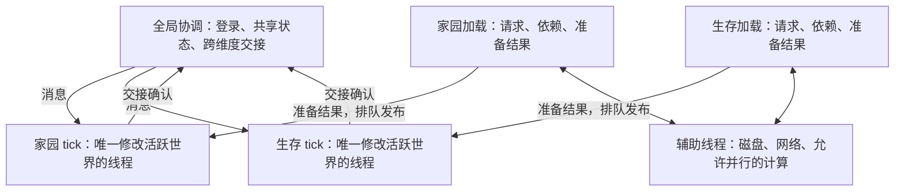

# 维度双线程调度原型

此目录保留早期独立模型。后续已新增原生 Minecraft 适配，当前实现与测试状态见 [原生维度线程说明](../../docs/dimension-threading.md)。下文关于“未接入”的描述仅指这里的模型本身。

状态：独立 Java 可执行模型，**尚未接入 Minecraft tick、区块生成或存档**，不会打包进核心 JAR，也不会改变正式服务器。不要把此模型的检查通过理解为整包已经支持维度多线程。

目标是每个活跃维度拥有固定的 tick 线程与加载调度线程，全服协调及网络/磁盘辅助线程单独保留。家园和生存因此有四个专属工作线程；线程并不等于独占 CPU 核心，也不意味着同时生成越多区块越快。



## 模型已实现

- 固定五个线程：协调、家园 tick/加载、生存 tick/加载。模型中的 tick 间隔是 10ms，仅为快速测试，不是 Minecraft TPS 设置。
- 有界消息队列、过载明确失败，不使用 CallerRunsPolicy 把加载偷偷转回 tick 线程。
- 加载产生不可变数据，经所属 tick 队列发布；不让加载线程写入模型中的活跃区块表。
- 加载阻塞时，两个 tick 和另一维度加载仍可推进。
- 玩家交接由协调线程登记，源线程移出、目标线程接收；目标拒绝时回滚。阻止同一玩家并发交接。
- 异常通过 future 返回；致命 tick 异常停掉所属 actor，不悄悄跳过错误。
- 关闭会取消模型任务并结束线程；真实服务器还必须实现排空、保存与重启恢复。

`DimensionThreadModelTest` 有 19 项检查，包含受控加载阻塞、线程归属、队列过载、目标拒绝回滚、重复交接、连续 100 次往返、异常与线程退出。已额外在 10 个独立 JVM 中重复运行，190 项检查和 1,000 次交接均通过，见 `build/dimension-thread-model/repeat-summary.json`。用的是模拟区块/玩家数据，未触碰 ServerLevel。

复现（在核心仓库目录）：

```powershell
python tests/run_dimension_thread_model.py --java-home ../perf-lab/java21/jdk-21.0.2
```

结果：`build/dimension-thread-model/result.json`，显式记录 `minecraftIntegrated: false`。

## Minecraft 接入前必须解决的具体问题

1. 本地 Minecraft 1.21.1 的 `MinecraftServer.tickChildren` 还在顺序处理世界、全局函数、网络与玩家列表。仅异步调用 `ServerLevel.tick` 不会迁移这些关联操作，也不会自动更改线程归属检查。
2. 原版和模组世界生成会访问邻区块及 ServerLevel，不能直接等同模型中的纯函数。需要梳理区块状态依赖、相邻区域访问权限、光照、票据与 FULL 激活阶段；加载线程不能与 tick 同时改同一块活跃数据。
3. tick 内同步请求区块不得形成“tick 等加载，加载又等 tick 发布”的循环等待。需异步请求、分阶段发布，并处理确实需要同步结果的原版/模组入口。
4. 核心现有 `DailyTasksFeature`、`ChallengeFeature` 在 ServerTickEvent 操作玩家/世界；维度门配对集中存于家园 SavedData，当前传送是同步路径。它们都需要明确归属与消息化，不能跟随世界 tick 偷跑到任意线程。
5. 真实传送应先准备目标区块、确认双方状态，再提交移交；需要可持久化的交接记录、断线/停服/崩溃恢复。当前模型的内存回滚不具备崩溃恢复能力。
6. 各模组静态缓存、全局随机数、事件回调和共享存储需要运行时线程检查。独立维度不等于模组数据隔离。不能靠吞异常或直接放宽主线程检查来宣称兼容。
7. 真实 tick 是否保留每轮全局同步屏障，需要结合时间、玩家、模组事件兼容验证；有屏障时整体进度仍受最慢维度约束，不能宣称某维度卡顿绝不影响另一维度。

## C2ME 替代方向

目标可选择移除 C2ME，避免两套调度器同时管理区块。但“每维度两个线程”不等于替代了 C2ME 的全部职责。实际安装的 `0.4.0-alpha.0.120` 包还含区块系统重写、区块 IO、光照线程、世界生成/IO 线程安全修复、噪声计算等模块。

应先以**移除 C2ME 后的原版/NeoForge 管线**建立对照，保留能直接复用的原版磁盘/网络机制，再逐步接入自己的线程归属与调度。不必重写所有优化，但不能遗漏正确性保障。现有 `fastasyncworldsave`、Lithium 和暮色线程安全附加包也需在新管线下验证，当前没有一并删除。

已增加仅影响一次性实验目录的开关：

```powershell
python tests/run_tasks_smoke.py --worldgen-audit --without-c2me --seed 12345 --java-home ../perf-lab/java21/jdk-21.0.2
```

它只在复制实验模组时跳过 C2ME，记录被排除 JAR 与核心 SHA，运行时报告实际加载的 C2ME 模块清单。不能和 `--serial-worldgen` 同用；后者是 C2ME 配置，与移除方案无关。

首轮无 C2ME 基线（种子 12345）：`build/tasks-smoke-20260928-175419-942940/tasks-smoke-result.json`。运行时 C2ME 模块为空，服务端正常退出；135 个群系、281 种生物候选、557 个结构候选相同，12,675 个群系坐标和 96 个结构候选区块数据相同，但 12 个完整区块中有一个区块出现 2 个凝灰岩/闪长岩差异，A/B 整体判定失败。保留失败结果，不把启动成功称为替代验收通过。

本地原版 `Util.makeExecutor/getMaxThreads` 字节码确认仍有后台工作线程池，可用 JVM 属性 `max.bg.threads` 控制。诊断开关 `--vanilla-bg-threads 1` 会在无 C2ME 测试中设置该属性；它限制的是原版共享后台池，不是已经实现了每维度专属加载线程。

追加对照已通过：`build/tasks-smoke-20260928-175708-542381/tasks-smoke-result.json`。种子 12345，无 C2ME，`max.bg.threads=1`，12,675 个群系采样、12 个完整区块共 1,179,648 个方块状态、96 个建筑候选区块的结构数据均零差异，季节/Mowzie 维度条件/Goblin 计时器检查通过，退出码 0。这是一个种子的有限样本；该 JVM 属性控制 ForkJoinPool 目标并行度，不等于整个 JVM 只有一个加载线程，也不证明自研管线已经完成或性能更好。

```powershell
python tests/run_tasks_smoke.py --worldgen-audit --without-c2me --vanilla-bg-threads 1 --seed 12345 --java-home ../perf-lab/java21/jdk-21.0.2
```

这两轮使用的仍是已有核心 1.9.1（SHA-256 `c46a8b061cd59bc45d3fe1abdb53694e3bbbbde700e396c6705b73372b650c28`），没有安装调度模型；仅改变一次性测试服的 C2ME/后台池条件。全部测试 Java 进程退出后可继续保留这些目录用于复核，不作为正式存档使用。

## 后续验收标准

接入后要重新执行群系/方块/建筑 A/B、真实客户端点火往返与重连；增加双维度同时探索、机器与生物负载、加载积压上限、p95/p99 tick 耗时、保存重启、传送中断和故障注入。调度模型通过或无 C2ME 基线通过，都不能代替这些真实整包验收。

参考：[C2ME NeoForge 官方仓库](https://github.com/RelativityMC/C2ME-neoforge)、[Dimensional Threading Reforked 官方仓库](https://github.com/SrRapero720/dimthreads)。后者也明确说明维度同步屏障会令总体进度受最慢维度影响；并非即装即用的当前整包兼容保证。
